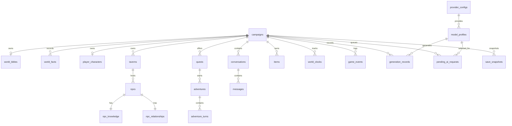

# Ember Tavern SQLite 数据模型

## 1. 范围与原则

本文定义 v0.1 首版 SQLite ER 模型，是 `M2-T02` 创建迁移的依据。模型覆盖 `docs/spec.md` 第24.2节列出的全部22张核心表，不在本任务创建迁移或实现Repository。

- SQLite 是游戏状态的唯一真实数据源；UI缓存和模型会话都不能替代本模型。
- 所有主键和领域外键使用M1协议定义的不透明字符串ID，SQLite类型为 `TEXT`。
- 时间使用规范UTC ISO 8601字符串，SQLite类型为 `TEXT`。
- 布尔值使用 `INTEGER NOT NULL CHECK (value IN (0, 1))`。
- 枚举使用 `TEXT` 并由 `CHECK` 约束已知值；读取层仍须对未来版本未知值执行显式兼容处理。
- 每个JSON列必须是规范JSON文本，并在迁移中添加 `CHECK (json_valid(column))`；Repository负责按对应M1协议验证内部结构。
- 外键始终启用：每个连接执行 `PRAGMA foreign_keys = ON`。写事务使用 `BEGIN IMMEDIATE`，一次回合的消息、状态、关系、事实和事件必须原子提交。
- API Key、登录令牌和安全密钥永不进入SQLite。`provider_configs`只保存安全存储返回的 `credential_ref`。

删除策略：删除Campaign时级联删除其游戏内容；全局Provider和模型配置不随Campaign删除。正常产品流程使用 `campaigns.archived_at` 归档，不做物理删除。

## 2. 关系总览

## 3. 游戏事实表

下表中的 `PK`、`FK`、`UQ` 分别表示主键、外键和唯一约束。除明确标记可空的字段外，字段均为 `NOT NULL`。

### 3.1 `campaigns`

| 字段 | 类型/约束 | 含义 |
| --- | --- | --- |
| `id` | TEXT PK | CampaignId |
| `schema_version` | INTEGER CHECK >= 1 | 当前存档Schema版本 |
| `state` | TEXT CHECK CampaignState | Campaign状态机状态 |
| `resume_state` | TEXT NULL | 异常状态恢复目标 |
| `default_model_profile_id` | TEXT NULL FK → model_profiles.id, ON DELETE SET NULL | 默认模型 |
| `fallback_model_profile_id` | TEXT NULL FK → model_profiles.id, ON DELETE SET NULL | 备用模型 |
| `task_model_overrides_json` | TEXT JSON | AI任务到模型档案ID的映射 |
| `model_switch_policy` | TEXT | ASK、SAME_PROVIDER、CROSS_PROVIDER或DISABLED |
| `created_at` | TEXT | 创建时间 |
| `updated_at` | TEXT | 最后修改时间 |
| `archived_at` | TEXT NULL | 归档时间 |

索引：`idx_campaigns_updated_at(updated_at DESC)`、`idx_campaigns_state(state)`。JSON：`task_model_overrides_json` 是 `{ "<AITask>": "<ModelProfileId>" }`，默认 `{}`。

### 3.2 `world_bibles`

| 字段 | 类型/约束 | 含义 |
| --- | --- | --- |
| `campaign_id` | TEXT PK/FK → campaigns.id ON DELETE CASCADE | 一存档一份世界圣经 |
| `schema_version` | INTEGER CHECK >= 1 | 协议版本 |
| `name` | TEXT | 世界名 |
| `current_region` | TEXT | 当前地区 |
| `summary` | TEXT | 世界摘要 |
| `core_conflict` | TEXT | 核心冲突 |
| `technology_level` | TEXT | 技术水平 |
| `power_rules_json` | TEXT JSON | 力量/魔法规则字符串数组 |
| `factions_json` | TEXT JSON | `Faction[]`，含关系与目标 |
| `locations_json` | TEXT JSON | `Location[]`，含父地点和控制势力 |
| `narrative_style` | TEXT | 叙事风格 |
| `forbidden_elements_json` | TEXT JSON | 禁止内容字符串数组 |
| `tavern_reason` | TEXT | 酒馆存在原因 |
| `story_hooks_json` | TEXT JSON | 剧情线索字符串数组 |
| `locked_fields_json` | TEXT JSON | `WorldBibleLockableField[]` |
| `created_at` | TEXT | 创建时间 |
| `updated_at` | TEXT | 修改时间 |

索引：主键已满足按Campaign读取；`idx_world_bibles_updated_at(updated_at)`用于备份增量检查。

### 3.3 `world_facts`

| 字段 | 类型/约束 | 含义 |
| --- | --- | --- |
| `id` | TEXT PK | WorldFactId |
| `campaign_id` | TEXT FK → campaigns.id ON DELETE CASCADE | 所属存档 |
| `kind` | TEXT CHECK WorldFact.kind | LOCKED_RULE等五类 |
| `statement` | TEXT | 事实文本 |
| `location_id` | TEXT NULL | 嵌入世界地点ID；由Repository验证存在于locations_json |
| `faction_ids_json` | TEXT JSON | 相关FactionId数组 |
| `detail_json` | TEXT JSON | 类别专属字段 |
| `supersedes_fact_id` | TEXT NULL FK → world_facts.id ON DELETE RESTRICT | 发展事实替代链 |
| `created_at` | TEXT | 创建时间 |

索引：`idx_world_facts_campaign_kind(campaign_id, kind)`、`idx_world_facts_campaign_created(campaign_id, created_at)`、`idx_world_facts_supersedes(supersedes_fact_id)`。JSON：`detail_json`只保存判别联合专属字段，如锁定字段、过期时间、传闻真伪或相信该错误认知的NPC ID；共有字段保持独立列。

### 3.4 `player_characters`

| 字段 | 类型/约束 | 含义 |
| --- | --- | --- |
| `id` | TEXT PK | PlayerCharacterId |
| `campaign_id` | TEXT UQ/FK → campaigns.id ON DELETE CASCADE | v0.1一存档一角色 |
| `name` | TEXT | 角色名 |
| `gender` | TEXT NULL | 可选性别 |
| `age` | INTEGER NULL CHECK >= 0 | 可选年龄 |
| `concept` | TEXT | 概念 |
| `story_preferences_json` | TEXT JSON | 偏好字符串数组 |
| `content_boundaries_json` | TEXT JSON | 内容边界 |
| `class_archetype` | TEXT CHECK ClassArchetype | 基础职业原型 |
| `class_display_name` | TEXT | AI创作职业名 |
| `attributes_json` | TEXT JSON | 四项1至5且总计10的属性 |
| `traits_json` | TEXT JSON | 恰好两个CharacterTrait |
| `personal_goal` | TEXT | 长期目标 |
| `background_json` | TEXT JSON | CharacterBackground |
| `initial_equipment_ids_json` | TEXT JSON | 初始ItemId数组 |
| `created_at` | TEXT | 创建时间 |
| `updated_at` | TEXT | 修改时间 |

索引：唯一索引 `uq_player_characters_campaign(campaign_id)`。

### 3.5 `taverns`

| 字段 | 类型/约束 | 含义 |
| --- | --- | --- |
| `id` | TEXT PK | TavernId |
| `campaign_id` | TEXT FK → campaigns.id ON DELETE CASCADE | 所属存档 |
| `location_id` | TEXT | 世界地点ID，由Repository验证 |
| `name` | TEXT | 酒馆名 |
| `position` | TEXT | 位置描述 |
| `environment` | TEXT | 环境 |
| `special_rules_json` | TEXT JSON | 特殊规则字符串数组 |
| `long_term_problem` | TEXT | 长期问题 |
| `owner_npc_id` | TEXT NULL FK → npcs.id DEFERRABLE INITIALLY DEFERRED | 老板；生成事务完成前可空 |
| `changes_json` | TEXT JSON | TavernChange追加列表 |
| `created_at` | TEXT | 创建时间 |
| `updated_at` | TEXT | 修改时间 |

索引：`idx_taverns_campaign(campaign_id)`、`idx_taverns_owner(owner_npc_id)`。常驻与访客由 `npcs.residency` 查询，不重复保存ID数组。

### 3.6 `npcs`

| 字段 | 类型/约束 | 含义 |
| --- | --- | --- |
| `id` | TEXT PK | NpcId |
| `campaign_id` | TEXT FK → campaigns.id ON DELETE CASCADE | 所属存档 |
| `tavern_id` | TEXT FK → taverns.id ON DELETE CASCADE | 当前酒馆 |
| `residency` | TEXT CHECK OWNER/RESIDENT/TEMPORARY_VISITOR | 居留类型 |
| `name` | TEXT | 姓名 |
| `identity` | TEXT | 身份 |
| `appearance` | TEXT | 外貌 |
| `personality` | TEXT | 性格 |
| `goal` | TEXT | 目标 |
| `secret` | TEXT | 秘密 |
| `speech_style` | TEXT | 语言风格 |
| `current_mood` | TEXT | 当前情绪 |
| `current_status` | TEXT CHECK NpcStatus | ACTIVE等状态 |
| `visit_json` | TEXT NULL JSON | 临时访客原因、到达与计划离开时间 |
| `memories_json` | TEXT JSON | NpcMemory追加列表 |
| `created_at` | TEXT | 创建时间 |
| `updated_at` | TEXT | 修改时间 |

索引：`idx_npcs_tavern_residency(tavern_id, residency)`、`idx_npcs_campaign_status(campaign_id, current_status)`。

### 3.7 `npc_knowledge`

| 字段 | 类型/约束 | 含义 |
| --- | --- | --- |
| `npc_id` | TEXT PK/FK → npcs.id ON DELETE CASCADE | 一NPC一份认知 |
| `known_fact_ids_json` | TEXT JSON | 已知WorldFactId数组 |
| `suspected_fact_ids_json` | TEXT JSON | 怀疑数组 |
| `false_belief_fact_ids_json` | TEXT JSON | 错误认知数组 |
| `excluded_secret_fact_ids_json` | TEXT JSON | 明确不可知秘密数组 |
| `updated_at` | TEXT | 修改时间 |

索引：主键满足按NPC读取。JSON中的ID由Repository验证属于同一Campaign；不使用全知事实查询构建NPC上下文。

### 3.8 `npc_relationships`

| 字段 | 类型/约束 | 含义 |
| --- | --- | --- |
| `npc_id` | TEXT PK/FK → npcs.id ON DELETE CASCADE | NPC |
| `player_character_id` | TEXT FK → player_characters.id ON DELETE CASCADE | 玩家角色 |
| `trust` | INTEGER CHECK BETWEEN -5 AND 5 | 信任 |
| `closeness` | INTEGER CHECK BETWEEN -5 AND 5 | 亲近 |
| `awe` | INTEGER CHECK BETWEEN -5 AND 5 | 敬畏 |
| `obligation` | INTEGER CHECK BETWEEN -5 AND 5 | 亏欠 |
| `updated_at` | TEXT | 修改时间 |

约束/索引：`UNIQUE(npc_id, player_character_id)`、`idx_npc_relationships_character(player_character_id)`。单回合±1由领域规则验证，更新必须与GameEvent同事务。

### 3.9 `quests`

| 字段 | 类型/约束 | 含义 |
| --- | --- | --- |
| `id` | TEXT PK | QuestId |
| `campaign_id` | TEXT FK → campaigns.id ON DELETE CASCADE | 所属存档 |
| `publisher_npc_id` | TEXT FK → npcs.id ON DELETE RESTRICT | 发布者 |
| `content_json` | TEXT JSON | 标题、简介、目标、失败代价 |
| `status` | TEXT CHECK QuestStatus | AVAILABLE至ABANDONED |
| `risk` | TEXT CHECK QuestRisk | 风险 |
| `recommended_attributes_json` | TEXT JSON | 推荐属性数组 |
| `expected_turns_min` | INTEGER CHECK >= 1 | 最少回合 |
| `expected_turns_max` | INTEGER CHECK >= expected_turns_min | 最多回合 |
| `reward_tier` | TEXT CHECK RewardTier | 程序控制奖励等级 |
| `related_npc_ids_json` | TEXT JSON | 相关NPC ID |
| `related_fact_ids_json` | TEXT JSON | 相关事实ID |
| `created_at` | TEXT | 创建时间 |
| `updated_at` | TEXT | 修改时间 |

索引：`idx_quests_campaign_status(campaign_id, status)`、`idx_quests_publisher(publisher_npc_id)`。

### 3.10 `adventures`

| 字段 | 类型/约束 | 含义 |
| --- | --- | --- |
| `id` | TEXT PK | AdventureId |
| `campaign_id` | TEXT FK → campaigns.id ON DELETE CASCADE | 所属存档 |
| `quest_id` | TEXT FK → quests.id ON DELETE RESTRICT | 来源任务 |
| `state` | TEXT CHECK AdventureState | 状态机状态 |
| `plan_json` | TEXT JSON | 玩家不可见AdventurePlan |
| `current_turn_number` | INTEGER CHECK >= 0 | 当前回合 |
| `clues_json` | TEXT JSON | Clue数组 |
| `ending_json` | TEXT NULL JSON | SETTLED后的AdventureEnding |
| `created_at` | TEXT | 创建时间 |
| `updated_at` | TEXT | 修改时间 |

索引：`idx_adventures_campaign_state(campaign_id, state)`、`idx_adventures_quest(quest_id)`。迁移创建部分唯一索引，保证每个Campaign最多一个状态非SETTLED的主冒险。

### 3.11 `adventure_turns`

| 字段 | 类型/约束 | 含义 |
| --- | --- | --- |
| `id` | TEXT PK | TurnId |
| `adventure_id` | TEXT FK → adventures.id ON DELETE CASCADE | 所属冒险 |
| `turn_number` | INTEGER CHECK >= 1 | 回合序号 |
| `scene_text` | TEXT | 场景文本 |
| `speaker_npc_ids_json` | TEXT JSON | 发言NPC ID |
| `suggested_actions_json` | TEXT JSON | 建议行动数组 |
| `player_action_json` | TEXT NULL JSON | PlayerAction |
| `check_request_json` | TEXT NULL JSON | CheckRequest |
| `dice_result_json` | TEXT NULL JSON | 本地DiceResult |
| `created_at` | TEXT | 创建时间 |
| `resolved_at` | TEXT NULL | 结算时间 |

约束/索引：`UNIQUE(adventure_id, turn_number)`、`idx_adventure_turns_adventure_created(adventure_id, turn_number)`。骰子必须持久化在 `dice_result_json`，不能只存在UI。

### 3.12 `conversations`

| 字段 | 类型/约束 | 含义 |
| --- | --- | --- |
| `id` | TEXT PK | 对话ID |
| `campaign_id` | TEXT FK → campaigns.id ON DELETE CASCADE | 所属存档 |
| `kind` | TEXT CHECK NPC/ADVENTURE/SYSTEM | 对话用途 |
| `npc_id` | TEXT NULL FK → npcs.id ON DELETE SET NULL | NPC对话对象 |
| `adventure_id` | TEXT NULL FK → adventures.id ON DELETE SET NULL | 冒险消息流 |
| `created_at` | TEXT | 创建时间 |
| `updated_at` | TEXT | 修改时间 |

约束：NPC种类必须有 `npc_id`，ADVENTURE种类必须有 `adventure_id`。索引：`idx_conversations_campaign_updated(campaign_id, updated_at DESC)`、`idx_conversations_npc(npc_id)`、`idx_conversations_adventure(adventure_id)`。

### 3.13 `messages`

| 字段 | 类型/约束 | 含义 |
| --- | --- | --- |
| `id` | TEXT PK | 消息ID |
| `conversation_id` | TEXT FK → conversations.id ON DELETE CASCADE | 所属对话 |
| `sequence_number` | INTEGER CHECK >= 1 | 稳定顺序 |
| `role` | TEXT CHECK PLAYER/NPC/NARRATOR/SYSTEM | 本地语义角色 |
| `speaker_npc_id` | TEXT NULL FK → npcs.id ON DELETE SET NULL | NPC发言者 |
| `content` | TEXT | 已确认展示文本 |
| `generation_record_id` | TEXT NULL FK → generation_records.id ON DELETE SET NULL | AI来源 |
| `created_at` | TEXT | 创建时间 |

约束/索引：`UNIQUE(conversation_id, sequence_number)`、`idx_messages_conversation_sequence(conversation_id, sequence_number)`。消息是本地历史，不保存厂商会话ID作为事实来源。

### 3.14 `items`

| 字段 | 类型/约束 | 含义 |
| --- | --- | --- |
| `id` | TEXT PK | ItemId |
| `campaign_id` | TEXT FK → campaigns.id ON DELETE CASCADE | 所属存档 |
| `owner_character_id` | TEXT NULL FK → player_characters.id ON DELETE SET NULL | 当前持有人 |
| `source_adventure_id` | TEXT NULL FK → adventures.id ON DELETE SET NULL | 来源冒险 |
| `content_json` | TEXT JSON | AI创作名称与描述 |
| `reward_tier` | TEXT CHECK RewardTier | 程序等级 |
| `effect_json` | TEXT JSON | 程序控制ItemEffect |
| `created_at` | TEXT | 创建时间 |

索引：`idx_items_campaign_owner(campaign_id, owner_character_id)`、`idx_items_source_adventure(source_adventure_id)`。

### 3.15 `world_clocks`

| 字段 | 类型/约束 | 含义 |
| --- | --- | --- |
| `id` | TEXT PK | WorldClockId |
| `campaign_id` | TEXT FK → campaigns.id ON DELETE CASCADE | 所属存档 |
| `name` | TEXT | 时钟名 |
| `current` | INTEGER CHECK >= 0 | 当前格 |
| `max` | INTEGER CHECK >= 1 AND current <= max | 最大格 |
| `stages_json` | TEXT JSON | 唯一阈值与标题数组 |
| `created_at` | TEXT | 创建时间 |
| `updated_at` | TEXT | 修改时间 |

索引：`idx_world_clocks_campaign(campaign_id)`。单次推进1和阶段唯一性由M1领域规则验证；数据库范围约束作为第二道防线。

## 4. 审计、AI与恢复表

### 4.1 `game_events`

| 字段 | 类型/约束 | 含义 |
| --- | --- | --- |
| `id` | TEXT PK | GameEventId |
| `campaign_id` | TEXT FK → campaigns.id ON DELETE CASCADE | 所属存档 |
| `schema_version` | INTEGER CHECK >= 1 | 事件协议版本 |
| `type` | TEXT CHECK GameEventType | 事件判别字段 |
| `payload_json` | TEXT JSON | 与type匹配的GameEvent payload |
| `occurred_at` | TEXT | 发生时间 |

索引：`idx_game_events_campaign_time(campaign_id, occurred_at, id)`、`idx_game_events_campaign_type(campaign_id, type)`。Repository必须在序列化前验证判别联合。

### 4.2 `generation_records`

| 字段 | 类型/约束 | 含义 |
| --- | --- | --- |
| `id` | TEXT PK | 生成记录ID |
| `campaign_id` | TEXT FK → campaigns.id ON DELETE CASCADE | 所属存档 |
| `request_id` | TEXT UQ | 对应AI请求 |
| `task` | TEXT | AITask |
| `model_profile_id` | TEXT NULL FK → model_profiles.id ON DELETE SET NULL | 实际模型 |
| `prompt_version` | INTEGER CHECK >= 1 | 提示词版本 |
| `request_json` | TEXT JSON | 规范化请求和裁剪后上下文 |
| `raw_response_text` | TEXT NULL | 原始返回；传输阶段失败时为空 |
| `validated_output_json` | TEXT NULL JSON | 通过结构验证的结果 |
| `validation_error_json` | TEXT NULL JSON | 结构/业务错误详情 |
| `started_at` | TEXT | 开始时间 |
| `completed_at` | TEXT NULL | 完成时间 |

索引：`idx_generation_records_campaign_time(campaign_id, started_at)`、`idx_generation_records_task(task)`。不保存API Key或Authorization头。

### 4.3 `pending_ai_requests`

| 字段 | 类型/约束 | 含义 |
| --- | --- | --- |
| `id` | TEXT PK | requestId |
| `campaign_id` | TEXT FK → campaigns.id ON DELETE CASCADE | 所属存档 |
| `turn_id` | TEXT NULL FK → adventure_turns.id ON DELETE CASCADE | 可选回合 |
| `idempotency_key` | TEXT UQ | 防重复提交键 |
| `task` | TEXT | AITask |
| `status` | TEXT CHECK 请求生命周期状态 | CREATED至CANCELLED |
| `model_profile_id` | TEXT NULL FK → model_profiles.id ON DELETE SET NULL | 选定模型 |
| `input_json` | TEXT JSON | 任务输入 |
| `context_json` | TEXT NULL JSON | 已构建最小上下文 |
| `attempt_count` | INTEGER CHECK >= 0 | 尝试次数 |
| `last_error_json` | TEXT NULL JSON | 最近错误 |
| `created_at` | TEXT | 创建时间 |
| `updated_at` | TEXT | 修改时间 |

索引：`idx_pending_requests_campaign_status(campaign_id, status)`、`idx_pending_requests_updated(updated_at)`。请求COMMITTED前不得单独提交其状态补丁。

### 4.4 `save_snapshots`

| 字段 | 类型/约束 | 含义 |
| --- | --- | --- |
| `id` | TEXT PK | 快照ID |
| `campaign_id` | TEXT FK → campaigns.id ON DELETE CASCADE | 所属存档 |
| `kind` | TEXT CHECK AUTO/MANUAL/BACKUP/IMPORT | 快照类型 |
| `reason` | TEXT | 创建原因 |
| `schema_version` | INTEGER CHECK >= 1 | 快照Schema |
| `payload` | BLOB | 完整、可恢复的规范快照 |
| `checksum_sha256` | TEXT | payload校验和 |
| `created_at` | TEXT | 创建时间 |

索引：`idx_save_snapshots_campaign_time(campaign_id, created_at DESC)`、`idx_save_snapshots_campaign_kind(campaign_id, kind, created_at DESC)`。保留数量由备份服务执行，不通过触发器静默删除。

### 4.5 `provider_configs`

| 字段 | 类型/约束 | 含义 |
| --- | --- | --- |
| `id` | TEXT PK | Provider配置ID |
| `provider_type` | TEXT | Native、OpenAI-Compatible或Local类型 |
| `preset_key` | TEXT | deepseek、ollama、custom等 |
| `display_name` | TEXT | 用户可见名称 |
| `base_url` | TEXT NULL | 服务地址 |
| `credential_ref` | TEXT NULL | 安全密钥存储引用 |
| `options_json` | TEXT JSON | 非秘密请求选项 |
| `enabled` | INTEGER BOOLEAN | 是否可选 |
| `created_at` | TEXT | 创建时间 |
| `updated_at` | TEXT | 修改时间 |

索引：`idx_provider_configs_enabled(enabled, display_name)`、`UNIQUE(preset_key, display_name)`。禁止字段：API Key、Authorization头、登录令牌或其他秘密值。

### 4.6 `model_profiles`

| 字段 | 类型/约束 | 含义 |
| --- | --- | --- |
| `id` | TEXT PK | 模型档案ID |
| `provider_config_id` | TEXT FK → provider_configs.id ON DELETE CASCADE | Provider配置 |
| `model_name` | TEXT | Provider模型名 |
| `display_name` | TEXT | 用户显示名 |
| `capabilities_json` | TEXT JSON | 文本、流式、system、JSON、工具、推理、上下文长度和计费状态 |
| `task_options_json` | TEXT JSON | 非秘密任务参数覆盖 |
| `enabled` | INTEGER BOOLEAN | 是否可选 |
| `capabilities_checked_at` | TEXT NULL | 能力/免费状态最近确认时间 |
| `created_at` | TEXT | 创建时间 |
| `updated_at` | TEXT | 修改时间 |

约束/索引：`UNIQUE(provider_config_id, model_name)`、`idx_model_profiles_enabled(enabled, display_name)`。免费状态只记录带检查时间的动态能力，不永久硬编码。

### 4.7 `app_settings`

| 字段 | 类型/约束 | 含义 |
| --- | --- | --- |
| `key` | TEXT PK | 设置键 |
| `value_json` | TEXT JSON | 非秘密设置值 |
| `updated_at` | TEXT | 修改时间 |

应用设置仅保存设备级非秘密偏好。API Key、令牌和Campaign游戏事实都不得写入此表。

## 5. JSON列清单与边界

| 表 | JSON列 |
| --- | --- |
| campaigns | task_model_overrides_json |
| world_bibles | power_rules_json, factions_json, locations_json, forbidden_elements_json, story_hooks_json, locked_fields_json |
| world_facts | faction_ids_json, detail_json |
| player_characters | story_preferences_json, content_boundaries_json, attributes_json, traits_json, background_json, initial_equipment_ids_json |
| taverns | special_rules_json, changes_json |
| npcs | visit_json, memories_json |
| npc_knowledge | known_fact_ids_json, suspected_fact_ids_json, false_belief_fact_ids_json, excluded_secret_fact_ids_json |
| quests | content_json, recommended_attributes_json, related_npc_ids_json, related_fact_ids_json |
| adventures | plan_json, clues_json, ending_json |
| adventure_turns | speaker_npc_ids_json, suggested_actions_json, player_action_json, check_request_json, dice_result_json |
| items | content_json, effect_json |
| world_clocks | stages_json |
| game_events | payload_json |
| generation_records | request_json, validated_output_json, validation_error_json |
| pending_ai_requests | input_json, context_json, last_error_json |
| provider_configs | options_json |
| model_profiles | capabilities_json, task_options_json |
| app_settings | value_json |

`npc_relationships`、`conversations`、`messages`和`save_snapshots`没有JSON文本列。快照payload是带校验和的二进制恢复包，不按JSON列处理。

## 6. 完整性与迁移要求

`M2-T02` 的 `0001_initial.sql` 必须：

1. 一次创建本文22张表、全部主外键、唯一约束、CHECK和索引；
2. 使用迁移记录保证重复启动不重复执行，而不是依赖忽略错误；
3. 对所有JSON文本列添加 `json_valid`；可空JSON列使用 `column IS NULL OR json_valid(column)`；
4. 使用延迟外键解决酒馆与老板NPC的生成环；
5. 为每个Campaign最多一个未SETTLED冒险创建部分唯一索引；
6. 不创建、记录或迁移任何API Key字段；
7. 由测试在新数据库启用外键后执行迁移，并以第二个连接验证数据仍可恢复。

## 7. 核心表覆盖核对

规格第24.2节的核心表全部覆盖：

`campaigns`、`world_bibles`、`world_facts`、`player_characters`、`taverns`、`npcs`、`npc_knowledge`、`npc_relationships`、`quests`、`adventures`、`adventure_turns`、`conversations`、`messages`、`items`、`world_clocks`、`game_events`、`generation_records`、`pending_ai_requests`、`save_snapshots`、`model_profiles`、`provider_configs`、`app_settings`。
